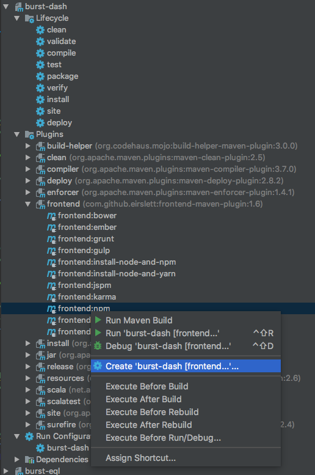

--

___Dash___ is a  [React](https://reactjs.org/) / [Redux](https://redux.js.org/)
Javascript application that provides use friendly administration,
authoring, & monitoring for the Burst ecosystem.
This module depends heavily on the [Rest](../burst-rest/readme.md) module
for the HTTP server, REST and Websocket communication protocols. The
[Burst Supervisor](../burst-supervisor/readme.md) JVM process hosts the rest service
which serves the Dash assets.

### Javascript Tool Chain
* [NPM definition](src/main/react/package.json):
-- Javascript dependency management
* [Webpack Config](src/main/react/webpack.config.js):
-- packaging of REACT application
* [Eirslett Frontend Maven Plugin](https://github.com/eirslett/frontend-maven-plugin):
-- Maven build/deploy/package of REACT application
* [React devtools](https://github.com/facebook/react-devtools)
-- View the React DOM's state and interact with it
* [Redux devtools](https://github.com/zalmoxisus/redux-devtools-extension):
-- View the store's state and interact with it

## IDE Configuration
IntelliJ is hopelessly behind the times and so default to the JS syntax of yesteryear.
To make the dreaded red squiggly disappear simply go to `Settings > Languages & Frameworks > Javascript`
and select ES6.

When developing a dash feature locally you can configure your IDE to watch the javascript files and
rerun the webpack build when one of the source file changes. This allows you to update the application
and see the changes with a simple browser refresh. There are 3 ways of setting up the watcher.
1. You can use the command `npm run watch` from `burst-dash/src/main/react`
1. You can use the command `mvn frontend:npm@local-dev` from `burst-dash`
1. You can configure a run task in IntelliJ
* 
* 

## Build
Building of the React application bundle happens during the standard
Burst maven build. The result of the packaging is resource artifacts in the
classpath of the final jar. These artifacts are loaded into the browser
via the bootload. The HTTP server is embedded and started up as the
__Burst Supervisor__ boots.

## Bootload
When the __Burst Supervisor__  process starts up, it
initiates a REST based API at a specified port. The rest API is used
to boot a REACT javascript application. A small set of UI static resources
are served by the REST API as well. Note: There are no HTTP interactions
that are *not* served by the REST API.

## Browser to Supervisor duplex communication
Once the Dash REACT application is started, it communicates with the
Supervisor via a combination of REST/JSON calls from Browser REACT Client to Supervisor Process, and
Websocket calls from Supervisor Process to Browser REACT Client.

---
------ [HOME](../readme.md) --------------------------------------------
