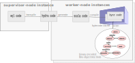

# `Burst Execution Model`

--- 

## `the language pipeline`
Burst has a multi-phase language pipeline. 

The phases are:
1. `eql` -- _user-friendly, high-level, declarative language_
1. `hydra` -- _high-performance, low-level, execution language_
1. `scala` -- _code generation platform_
1. `bytecode` -- _portable direct execution platform_

Behavioral analysis queries are written in **EQL** which is transpiled to **Hydra** on the
`master-node`. The **Hydra** is parsed and validated on the `master-node` and then sent
to the active `worker-node` instances. The **Hydra** is reparsed, validated, on the
`worker-node`
and then goes through a code generation phase, resulting in **Scala** code, which results in
**byte-code** closures which perform direct scan traversal and analytic processing
of the encoded binary [Brio](../../burst-brio) object-tree `blobs`.

### `phase 1 -- the eql language`
[EQL](../../burst-eql/readme.md) is the _front-end_ language for Burst. Though it is
possible to Generally
speaking this is the only public external facing language API for Burst. It is 
designed to support effective and efficient authoring of
Burst analyses. EQL knows how to translate (transpile) these human friendly 
declarative source statements into its own internal
`single-pass-scan` model and thus to the fully imperative  
Hydra language.

### `phase 2 -- the hydra language`
[Hydra](../../burst-hydra/readme.md) is the _back-end_ language for Burst. Hydra
(and its underlying semantic model [Felt](../../burst-felt/readme.md)) is where
the `single-pass-scan`, parallel,  distributed, partitioned,
`scatter-gather` model of Burst  is _activated_. The **EQL** statements become
**Hydra** types and behavior that directs the system
as it collects and processes data on the worker node and sends it back to the
master node.

### `phase 3 -- the scala language`
Hydra generates [Scala](https://www.scala-lang.org/) source language
defining types and behavior 
that directly define all the low level data structures
and algorithms that know how to scan the Brio blob and produce result
sets for the given analysis.

### `phase 4 -- java bytecode`
The generated Scala source language is then compiled into byte-code.
This is the most expensive part of the language processing pipeline
other than the scan itself of course.

Since the Scala
compilation is the most expensive part of the pipeline, and in order
to benefit from the full array of JIT compiling (warming) in the Java
world. It is important to understand the 

### `the single pass scan`

### `the byte code cache`

### `parameterization`

### `request pipeline`

### `results pipeline`
